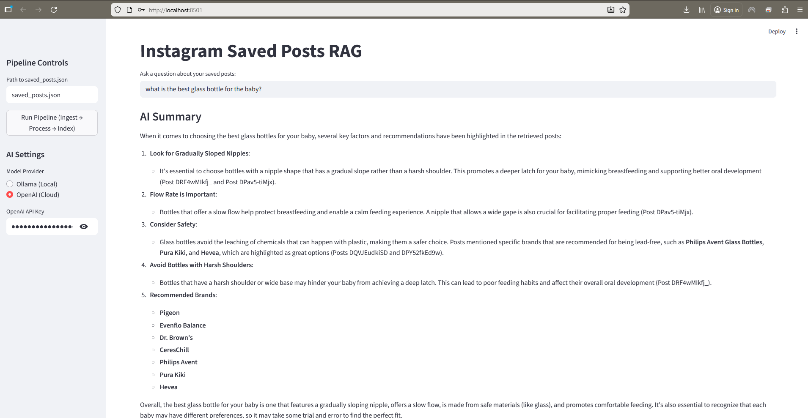
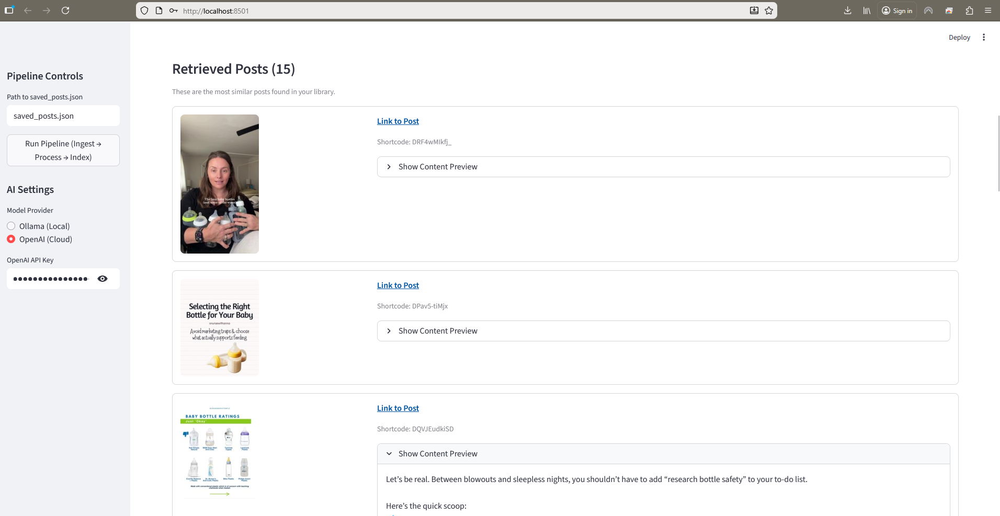

# Instagram Personal RAG

A powerful, multimodal RAG (Retrieval-Augmented Generation) system for your saved Instagram posts. 
This tool downloads text, audio, and visual content from your Instagram saved collection and makes it fully searchable using natural language.
⚠️ Important Disclaimers:
    Use at Your Own Risk: This tool automates the downloading of content from Instagram. This behavior may violate Instagram's Terms of Service. Extensive use could lead to IP bans, rate limiting, or account restrictions. The creator of this repository is not responsible for any actions taken against your account.
    Maintenance Status: This project is a "vibecoding" experiment. It is not actively maintained. If Instagram changes their JSON structure, this tool may break, and no updates are guaranteed.

**Key Features:**
*   **Multimodal Ingestion**: 
    *   **Text**: Captions and comments.
    *   **Audio**: Transcribes speech from Reels/Videos (using `faster-whisper`).
    *   **Visual**: Extracts text from images and **video keyframes** (using `easyocr`).
*   **Hybrid AI Search**:
    *   **Local Privacy**: Run completely offline using **Ollama** (Llama 3.2).
    *   **Cloud Power**: Switch to **OpenAI** (GPT-4o-mini) for enhanced reasoning.
*   **Smart Summaries**: Generates a concise answer/summary of your query based on the top 15 retrieved posts.
*   **RAG Pipeline**: Vector search backed by ChromaDB.

## Prerequisites
- **Python 3.9+**
- **[FFmpeg](https://ffmpeg.org/download.html)**: Installed and in your system PATH (Required for audio processing).
- **[Ollama](https://ollama.com/)** (Optional): If using local mode. Run `ollama pull llama3.2` to get the model.
- **OpenAI API Key** (Optional): If using cloud mode.

## Setup
1.  **Install Dependencies**:
    ```powershell
    pip install -r requirements.txt
    ```
2.  **Prepare Data**:
    *   Export your saved posts from Instagram ("Your Information" -> "Saved").
    *   Place `saved_posts.json` (or `saved_collections.json`) in the project root.
    *   *Note: Supports `saved_saved_media` and `saved_saved_collections` formats.*

## Usage
### 1. Start the Interface
```powershell
streamlit run app.py
```

### 2. Configure & Run Pipeline (Sidebar)
1.  **Pipeline Controls**: 
    *   Verify the path to your JSON file.
    *   Click **Run Pipeline**. This will download posts, extract keyframes/transcripts, and build the search index.
    *   *First run will download AI models (Whisper, EasyOCR, MiniLM) which may take time.*

2.  **AI Settings**:
    *   Select **Model Provider**:
        *   **Ollama (Local)**: Ensure `ollama serve` is running.
        *   **OpenAI (Cloud)**: Enter your API Key when prompted.

### 3. Ask Questions
*   Type queries like *"find recipes with glass bottles"* or *"what movies are recommended?"*.
*   **AI Summary**: Read a syntheized answer based on your posts.
*   **Retrieved Posts**: Browse the top 15 actual posts with images and extracted text preview.

## Troubleshooting
-   **FFmpeg Error**: Ensure `ffmpeg -version` works in your terminal.
-   **Ollama Connection Error**: Make sure Ollama is installed and running (`ollama serve`).
-   **Download Issues**: Private posts or rate limits may affect downloads. This tool works best with public posts or existing cookies (requires code modification for authentication). You can run multiple times if some posts are missing because of the rate limits.

## Screenshots

*The main interface with AI settings and Pipeline controls.*


*Example search results showing the AI Summary and Retrieved Posts.*

